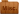

# June 4, 2018

##  Earthquake? Tornado?
- Rocks and trees overturned. Ground torn up.
- Collapsed bridge

##  Mysterious Cave
- **Description**: Torch lit, contains alters and goblins
- Goblin Shaman
- Sacrificial alters
- Stone glaive seemingly contained in fallen stalagtite
- Deeper in two goblins who are trying to figure out what to do with crazed goblin.

##  Goblin Shaman
- **Location**: Mysterious Cave
- **Description**: Elaborite Headpiece
- Afflicted with maddness
- Has recently butchered someone
- Deluded; believed he was casting spells but no effects showed
- Claimed to be doing the bidding of "him"
    - He was afraid of "him"
    - Wanted the glaive

##  Glaive
- **Location**: Mysterious cave
- Made of stone
- Upon touch Daemon was knocked unconcious
    - awoke in a sea of darkness (unulating but peacefull)
    - A Dark Figure
- 

##  A Dark Figure
- **Location**: Sea of Darkness
- **Description**: Four Red Eyes
- The being offered Daemon the power to defeat those he aimed to destroy
- Obtaining this power required making a pact
- Daemon agreed 
    - A symbol appeared on the back of Daemons hands

##  Mysterious Symbol
- After accepting the pact, a blood red symbol appears on the back of Daemon's hand.
- The symbol is not visible once Daemon returns to Faerun

##  Alter
- **Location**: Second room in cave
- Statue (bust). Two cat like eyes. One points up and to right, and other points nearly into back of head.

## 
- Shirra scouted ahead in dark cave (Daemon could not see)
    - Daemon gave end of rope to Shirra so she could signal too him
    - The rope went slack
    - Daemon went to investigate, and was knocked unconcious after a brief struggle.