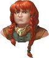
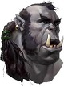

# June 6, 2018

## New NPCs

##  Buppido
- **Location**: Drow outpost / prison (Velkynvelve)
- **Description**: Derro Man
    - Believes this is all God's plan and that God will deliver him soon.

 

##  Eldeth
- **Location**: Drow outpost / prison (Velkynvelve)
- **Description**: Dwarf Woman
    - Keeps to self
    - Thinks all "dark dwellers" are scum

 

##  Jimjar
- **Location**: Drow outpost / prison (Velkynvelve)
- **Description**: Deep gnome man
    - Loves to bet.
    - Risk taker (jumped off bridge on a bet).
    - Bet's with Daemon
        - 20 gp to Daemon if we get out
        - 40 gp to Jimjar if he jumps off the bridge *with* us
        - 5 gp to Jimjar if Chet and Zen fight

 

##  Ront
- **Location**: Drow outpost / prison (Velkynvelve)
- **Description**: Orc Man
    - Volatile and aggressive.
    - Had a "stick". Actually was a pipe.
        - Chet managed to steal this item.

 

##  Sarith
- **Location**: Drow outpost / prison (Velkynvelve)
- **Description**: Drow man
    - Not quite sane.
    - Velkynvelve is drow outpost near Menzoberranzan.
    - Used to capture people and sell them into slavery.
    - The slaver convoy to Menzoberranzan is late / hasn't shown.

 

##  Shuushar
- **Location**: Drow outpost / prison (Velkynvelve)
- **Description**: Kuo-toa man (koo-o-TO-a)
    - From Sloobludop.
        - To the West.
        - Possibly the closest friendly city.

 

##  Stool
- **Location**: Drow outpost / prison (Velkynvelve)
- **Description**: ?? Looks like a mushroom...
    - Anxious, fearful
    - Seems fond of Wizard
        - Somehow Wizard can talk to him? Maybe?
    - Longs for home.

 

##  Topsy and Turvy
- **Location**: Drow outpost / prison (Velkynvelve)
- **Description**: Deep Gnoms
    - From Blightenstone
        - May serve as refuge for party.

## Jorlan
- A Drow recently demoted commander. Something Illvara?
- Appears injured with one eye.
- Picked on by Shoor

##  Shoor
- Jorlan's replacement.
- Seems arrogant.
- Picks on Jorlan.

 

## Locations
##  Velkynvelve
- Drow outpost / prison / slaving facility
- Near Menzoberranzan.

##  Menzoberranzan (MEN-zoh-buh-RAN-zan)
- Drow city (probably)

##  Sloobludop
- Shuushar's hometown.
-  West of Velkynvelve.

##  Blightenstone
- Home of Topsy and Turvey.

## Events
- Jorlan frees the captives to make Shoor look bad.
- The party reclaims their valuables in a small skirmish.
- The party jumps off cliff into water below, making an escape into nearest cavern.