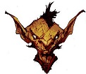
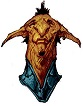

# July 10, 2018

## PC Updates
- Wizard
    - Has been stuck in caves
    - Was trying to capture evil to become headmaster of tower which traps evil
    - vague

- Chet
    - Maybe was married to a tree
        - Possible tree wife dead

## NPC Updates
- Ront
    - Left
- Eldeth
    - Pledged herself to helping the party
    - 'owes [us] a debt she will never forget'

## New NPCs

##  Yuk Yuk
- **Location**: Silken Road
- **Description**: Goblin Man
    - Offers to be travel guide across the 'Silken Road'

##  Spiderbait
- **Location**: Silken Road
- **Description**: Goblin Man
    - Offers to be travel guide across the 'Silken Road'

## New Locations

##  Silken Road
- **Description**: Wide chasm with lines of spider webs traversing along its path.
- Between Velkynvelve and Sloobludop

##  Gracklstugh
- **Description**: City across the 'DarkLake' from Sloobludop
- Has path to 'Neverlight Grove'
- Possible exit point.

##  DarkLake
- **Description**: Duergar City
- An underground lake between Sloobludop & Gracklstugh

##  Neverlight Grove
- **Description**: ?
- Accessible from Gracklstugh

## Notable Items
##  Faerez
- **Location:** Various Caves
- Can cause bouts of madness.
- Allegedly can bring people back to life or heal them.

##  Barrelstalk Mushroom  
- **Appearance:** Cask Like 
- **Effect:** None (nourishment)
- **Use:** Water and Food

##  Trillimac Mushroom   
- **Appearance:**  4 ft. tall & Leathery  Cap
- **Effect:** Unknown
- **Use:** Unknown

##  Zurkhwood Mushroom  
- **Appearance:** Tree Like
- **Effect:** Unknown
- **Use:** Firewood, logs. 
- Need axe to harvest

##  Nightlight Mushroom    
- **Appearance:** Glows in dark. Small.
- **Effect:** Indedible
- **Use:** Can be tapped 'On' and 'Off'
- Quickly dies if picked.

##  Nilhogg's Nose Mushroom   
- **Appearance:**  small white
- **Effect:** heightened sense for smell, followed by a lowered sense of smell later
- **Use:** Unknown

## Timmask Mushroom    
- **Appearance:**  orange and red stripped
- **Effect:** poisonous
- **Use:** Unknown

##  Tongue of Madness Mushroom   
- **Appearance:**  Tongue shaped
- **Effect:** speak aloud every thought (1 hr)
- **Use:** Unknown

##  Torchstalk Mushroom   
- **Appearance:**  small red
- **Effect:** Unknown
- **Use:** Flammable